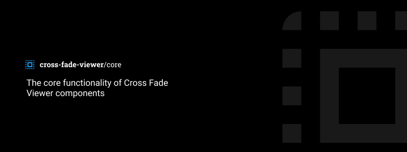

# cross-fade-viewer (Core)
Core functionality of cross fade viewer components.

## Testing

We use Deno's included testing functionality for simple unit tests. Simply run ``deno test`` in the project directory to run the tests.